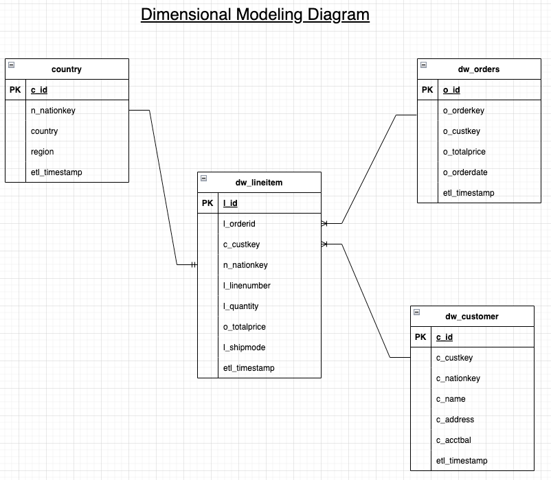
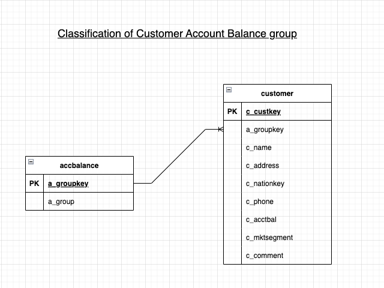

# The old fashion ETL Master

## Objective
Build ETL solution to ingest data from data.zip into Data Warehouse for reporting and analysis.

## ETL Infrastructure
### Storage
AWS S3 is used for storing data files. Data from these files are loaded into a database to perform data analysis and reporting.    


### Database 

PostgreSQL RDBMS is used for storing relational data. Data files from AWS S3 are ingested into database 'playground'. PostgreSQL docker version 11 is used to build the solution.

### Airflow

Apache Airflow is used for scheduling and monitoring workflows. Docker Airflow is used for development and building workflow solutions. Below link contains documentation to docker airflow.

https://github.com/puckel/docker-airflow

## ETL infrastructure diagram

Below is the ETL diagram showing data ingestion process.  


## Data flow process
### Source
Source files are in .tbl format and are stored in AWS S3 bucket. They are table files and hold data in table format. Python pandas module 'read_csv' can be used to read data from these files. Below files are stored in S3 bucket 'issplayground'.  
  
1. region.tbl
2. nation.tbl
3. part.tbl
4. supplier
5. partsupp
6. customer.tbl
7. orders.tbl
8. lineitem.tbl 

### Target
Airflow DAG 'dw_data_load' processes data from source files and loads it into database schema 'playground'. For data flow logic, refer python script 's3_postgresql.py'. Data from these files are populated into below transactional tables.
  
1. region
2. nation
3. part
4. supplier
5. partsupp
6. customer
7. orders
8. lineitem

Data from transactional tables are loaded into data warehouse (DW) tables that forms customer order star schema dimensional model. Data from this star schema model is used for customer order analysis and reporting. Below are the DW tables.

1. dw_customer
2. dw_country
3. dw_orders
4. dw_lineitem

Dimensional model diagram

Below is the customer order star schema dimensional model  




## Data ingestion process

Below scripts are used to create tables and ingest data.

1. CreateTableScript.sql

This script creates data warehouse tables. Data from these tables are consumed by reporting application for reporting and analytical purpose.

2. s3_postgresql.py  

This script reads data files from 'issplayground' S3 bucket into pandas dataframe. It then transform the data and loads it into transactional tables. It runs as Airflow DAG. The DAG is scheduled to run every 15 minutes.  

3. dw_dataload.py

This script reads data from transactional tables and loads data into customer order star schema data model. This runs as Airflow DAG. The DAG is scheduled to run daily at 10 PM.  

## Data Profiling

Below are data profiling techniques implemented for high data quality and integrity to help better decision making.

1. Identify keys, distinct values in each column that can help process inserts and updates.
    
2. Identify missing or unknown data. 
    
3. Identify length of the data to ensure appropriate data type length is selected
    
4. Ensure keys are always present in the data.
    
5. Check relationships like one-to-one, one-to-many, many-to-many, between related data sets to perform joins correctly.    
    
6. Check for Pattern and frequency distributions to ensure fields are formatted correctly.

Results of data profiling will lead to below benefits impacting analysis and design.

 - leads to higher-quality, more credible data.
 - helps with more accurate decision-making.
 - makes better sense of the relationships between different data sets and sources.
 - keeps information centralized and organized.
 - eliminates errors, such as missing values or outliers, that add costs to data-driven projects.
 - highlights areas within a system that experience the most data quality issues, such as data corruption or user input errors; and
   produces insights surrounding risks, opportunities and trends.

I have not used Profiling tools. I manually do profiling task like identifying keys (primary, unique), missing data, making sure every table has primary key and checking for relationships to build join queries.

From the below link I found some of the tools that can be used for data profiling
1. Talend Open Profiler
2. Quadient Data Cleaner
3. OpenRefine
4. Apache Griffin
5. Informatica

Reference:
https://hevodata.com/learn/data-profiling-tools/


## Implementation Steps

1. Pull postgres version 11 docker image. Start Postgres instance by providing database name, user, password and port number. Persist the data to local folder.  

Commands  
```
docker pull postgres:11
docker run --name postgres -e POSTGRES_USER=username -e POSTGRES_PASSWORD=password -p 5432:5432 -v /data:/var/lib/postgresql/data -d postgres
```

2. Pull Airflow docker and start the instance by running below command. Persists dag folder to local drive.  

```
docker run -d -p 8080:8080 -v /path/to/dags/on/your/local/machine/:/usr/local/airflow/dags  puckel/docker-airflow webserver
```

3. Create AWS S3 bucket 'issplayground'. Setup AWS S3 connection in Airflow by navigating to Admin -> Connections as shown below.

Provide access key Id in the login and secret key in the password. 


4. Setup connection to local PostgreSQL by navigating to Admin -> Connections as shown below. Host name host.docker.internal refers to postgres docker instance


5. Install Python modules from the requirement.txt file
```
pip install -r requirements.txt
```

6. Deploy DAG files s3_postgresql.py and dw_dataload.py into dag folder. Refresh Airflow web page. Deployed DAGS are displayed as shown below.


7. DAGS  

dw_data_load: loads data from transactional tables into star schema dimensional model
s3_postgresql: loads data from AWS S3 into transactional tables

## Data Reporting
ReportQueries.sql  

This script contains queries that helps business make executive decisions. Queries uses transactional tables for reporting. Report queries give analytical insights into top nations and customers in terms of revenue, top selling month and sales revenue. 

SQL queries within this script answer below questions  

1. What are the top 5 nations in terms of revenue?
2. From the top 5 nations, what is the most common shipping mode?
3. What are the top selling months?
4. Who are the top customer in terms of revenue and/or quantity?
5. Compare the sales revenue of on current period against previous period?

dw_reportingqueries.sql
This script contains queries that helps business make executive decisions. Queries uses customer order star schema dimensional model and provides same analytical insight as ReportQueries.sql. When compared to ReportQueries.sql, these queries uses less join to answer the above questions thus providing better read performance. This is one of the benefit of denormalization and star schema dimensional model.


## Customer account classification  
Customer account balance can be classified into 3 groups by creating a 'accbalance' table and establishing one to many relationship with customer table. This solution satisfy 3rd normal form. In future if more than 3 groups are required for classification, this solution can easily scale to meet the requirement without any data quality issue. 



## Add revenue per line item
This can be achieved by denormalization of orders and lineitem tables into a single table as shown below. 'o_totalprice' is the revenue column for order per line item


## Convert the dates to be distributed over the last 2 years

Data can be distributed over the last 2 years through partitioning. For instance below query will partition the orders table on the order date column.

```
CREATE TABLE orders (
    o_orderkey      INTEGER NOT NULL ,
    o_custkey       INTEGER NOT NULL,
    o_orderstatus   TEXT    NOT NULL,
    o_totalprice    INTEGER NOT NULL,
    o_orderdate     DATE    NOT NULL,
    o_orderpriority TEXT    NOT NULL,
    o_clerk         TEXT    NOT NULL,
    o_shippriority  INTEGER NOT NULL,
    o_comment       TEXT    NOT NULL
) PARTITION BY RANGE (o_orderdate);


CREATE TABLE orders_1998_1997 PARTITION OF orders
    FOR VALUES FROM ('1997-01-01') TO ('1998-12-31');
```    

## What to do if the data arrives in random order and times via streaming?

s3_postgresql dag runs every 15 minutes to load data from S3 bucket. This ensures data is ingested even if the data arrives at different times and in random order. The dag also handles conflict for duplicate records. The code can also be modified to do upsert for data ingestion. 

## Would be a problem if the data from the source system is growing at 6.1-12.7% rate a month?
lineitem and orders table are the biggest tables containing 60175 and 15000 records respectively. At a rate of 6.1-12.7%, lineitem table grows by 3671-7642 records a month. This is still manageable for the data ingestion. To improve the data load performance, delta load can be implemented by introducing timestamp column in source system and ingesting only new or modified records based on timestamp.

## Encoded file bonus_etl_data_gen.txt

Below python command can be used to detect encoding type.
Reference: https://stackoverflow.com/questions/436220/how-to-determine-the-encoding-of-text

```
import chardet
rawdata = open(r"/Users/abc/Downloads/bonus_etl_data_gen.txt", 'rb').read()
result = chardet.detect(rawdata)

output:
{'encoding': 'ascii', 'confidence': 1.0, 'language': ''}
```
Tried reading the text using below command, However, I was unsuccessful in decoding it.
```
data = open(
    r"/Users/ISSAC/Downloads/bonus_etl_data_gen.txt", encoding="ascii"
).read()
print(data)
```
 