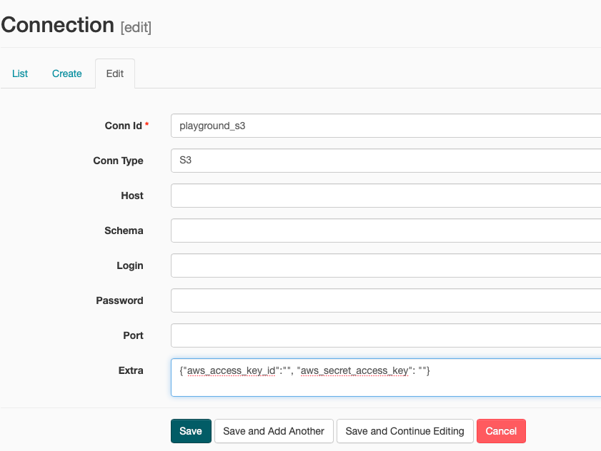
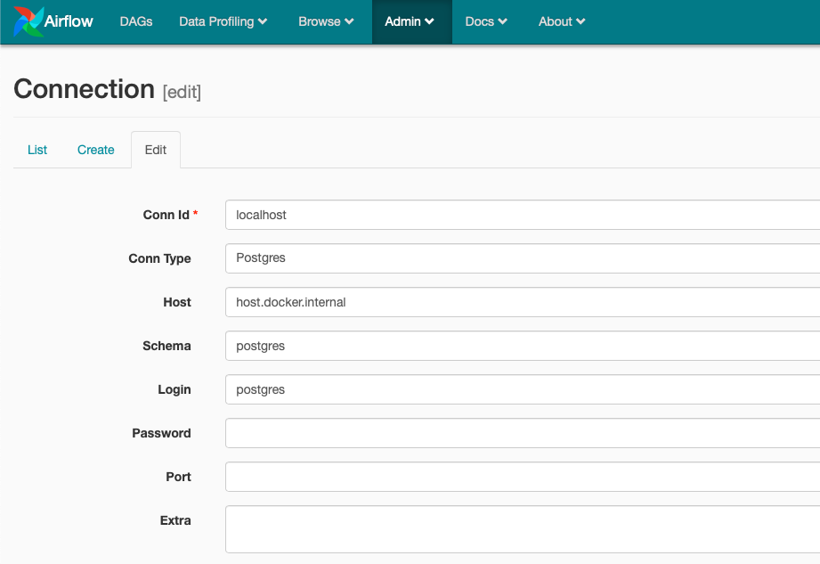

# The old fashion ETL Master

## Objective
Build ETL solution to ingest data from data.zip into Data Warehouse for reporting and analysis.

## ETL Infrastructure
### Storage
AWS S3 is used for storing data files. Data from these files are loaded into a database to perform data analysis and reporting.    

### Database 

PostgreSQL RDBMS is used for storing relational data. Data files from AWS S3 are ingested into database 'playground'. PostgreSQL docker version 11 is used to build the solution.

### Airflow

Apache Airflow is used for scheduling and monitoring workflows. Docker Airflow is used for development and building workflow solutions. Below link contains documentation of docker airflow.

https://github.com/puckel/docker-airflow

## ETL infrastructure diagram

Below is the ETL diagram showing data ingestion process.  

## Data flow process
### Source
Source files are in .tbl format and are stored in AWs S3 bucket. They are table files and hold data in table format. Python pandas module 'read_csv' is used to read data from these files. Below files are stored in S3 bucket 'issplayground'.  
  
1. region.tbl
2. nation.tbl
3. part.tbl
4. supplier
5. partsupp
6. customer.tbl
7. orders.tbl
8. lineitem.tbl 

### Target
Airflow DAG 'dw_data_load' processes data from source files and loads it into database schema 'playground'. For data flow logic, refer python script 's3_postgresql.py'. Data from these files are populated into below transactional tables.
  
1. region
2. nation
3. part
4. supplier
5. partsupp
6. customer
7. orders
8. lineitem

Data from transactional tables are loaded into data warehouse (DW) tables that forms customer order star schema dimensional model. Data from this star schema model is used for customer order analysis and reporting. Below are the DW tables.

1. dw_customer
2. dw_country
3. dw_orders
4. dw_lineitem

Dimensional model diagram

Below is the customer order star schema dimensional model  

## Data ingestion process

Below scripts are used to create tables and ingest data.

1. CreateTableScript.sql

This script creates data warehouse tables. Data from these tables are consumed by reporting application for reporting and analytical purpose.

2. s3_postgresql.py  

This script reads data files from 'issplayground' S3 bucket into pandas dataframe. It then transform the data and loads it into transactional tables. It runs as Airflow DAG. The DAG is scheduled to run every 15 minutes.  

3. dw_dataload.py

This script reads data from transactional tables and loads data into customer order star schema data model. This runs as Airflow DAG. The DAG is scheduledd to run daily at 10 PM.  

4. ReportQueries.sql  

This script contains queries that helps business make executive decisions. Report queries give analytical insights into top nations and customers in terms of revenue, top selling month and sales revenue. 

## Data Profiling

Below are data profiling techniques implemented for high data quality and integrity to help better decision making.

1. Identify keys, distinct values in each column that can help process inserts and updates.
    
2. Identify missing or unknown data. 
    
3. Identify length of the data to ensure appropriate data type and length is select
    
4. Ensure keys are always present in the data, using zero/blank/null analysis.    
    
5. Check relationships like one-to-one, one-to-many, many-to-many, between related data sets to perform joins correctly.    
    
6. Check for Pattern and frequency distributions to ensure fields are formatted correctly.

Results of data profiling will lead to below benefits impacting analysis and design.

 - leads to higher-quality, more credible data;
 - helps with more accurate decision-making;
 - makes better sense of the relationships between different data sets and sources;
 - keeps information centralized and organized;
 - eliminates errors, such as missing values or outliers, that add costs to data-driven projects;
 - highlights areas within a system that experience the most data quality issues, such as data corruption or user input errors; and
   produces insights surrounding risks, opportunities and trends.
   
Reference:
https://panoply.io/analytics-stack-guide/data-profiling-best-practices/
https://www.techtarget.com/searchdatamanagement/definition/data-profiling

## Implementation Steps

1. Pull postgres version 11 docker image. Start Postgres instance by providing database name, user, password and port number. Persist the data to local folder.
commands
a. docker pull postgres:11
b. docker run --name postgres -e POSTGRES_USER=username -e POSTGRES_PASSWORD=password -p 5432:5432 -v /data:/var/lib/postgresql/data -d postgres

2. Pull Airflow docker and start the instance by running below command. Persists dag folder to local drive.
docker run -d -p 8080:8080 -v /path/to/dags/on/your/local/machine/:/usr/local/airflow/dags  puckel/docker-airflow webserver

3. Setup AWS S3 connection in Airflow by naviagting to Admin -> Connections as shown below.

Provide access key Id in the login and secret key in the password. 

4. Setup connection to local PostgreSQL by naviagting to Admin -> Connections as shown below.

5. Deploy DAG files s3_postgresql.py and dw_dataload.py into dag folder. Refresh Airflow web page. Deployed DAGS are displayed as shown below.

6. DAGS  

dw_data_load: loads data from transactional tables into star schema dimensional model
s3_postgresql: loads data from AWS S3 into transactional tables

